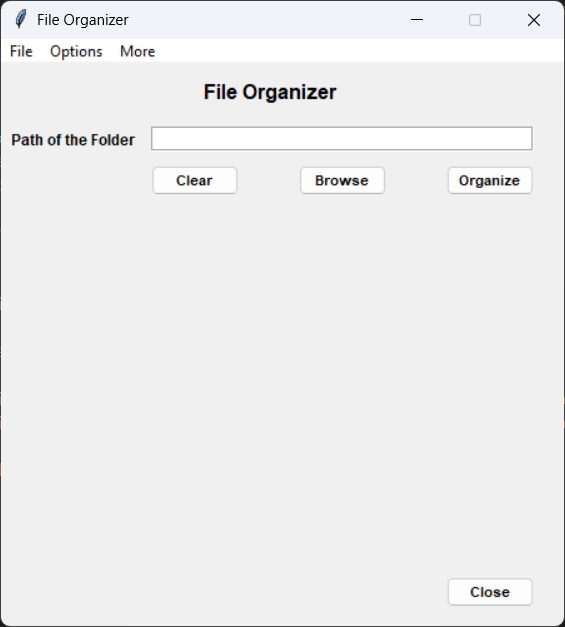
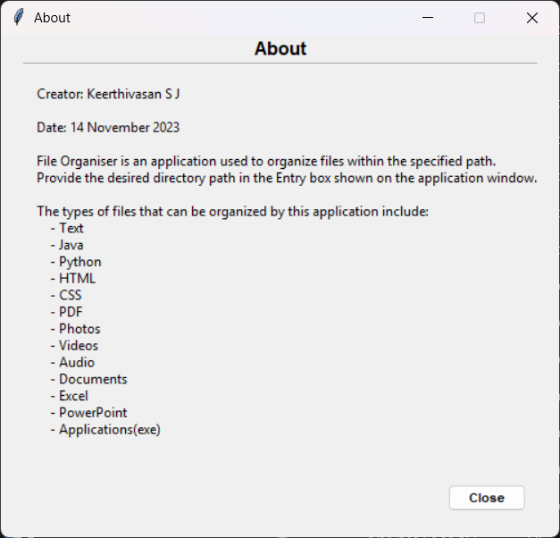

# 🗂️ File Organizer App

A simple yet powerful desktop application to organize files in a specified directory based on their types.


---

## 📌 About the App

**File Organizer** is a desktop utility designed to automatically sort and organize files located within a user-specified directory. With a single click, the application categorizes and relocates files into neatly organized folders based on file type.

---

## 🖼️ Screenshots

### 🔹 Main Page



### 🔹 About Page



> 📂 *Place your actual screenshot files in a folder named `screenshots/` inside your project directory for the above links to work properly.*

---

## 📁 Supported File Types

This app can organize the following types of files:

- 📄 Text Files (`.txt`)
- ☕ Java Files (`.java`)
- 🐍 Python Files (`.py`)
- 🌐 HTML Files (`.html`)
- 🎨 CSS Files (`.css`)
- 📚 PDF Files (`.pdf`)
- 🖼️ Photos (`.jpg`, `.png`, `.jpeg`, `.gif`, etc.)
- 🎬 Videos (`.mp4`, `.mkv`, `.avi`, etc.)
- 🎵 Audio Files (`.mp3`, `.wav`, etc.)
- 📝 Documents (`.doc`, `.docx`)
- 📊 Excel Files (`.xls`, `.xlsx`)
- 📽️ PowerPoint Files (`.ppt`, `.pptx`)
- 💻 Applications (`.exe`)

---

## Installation

To run this project locally:

```bash
# 1. Clone the repository
git clone https://github.com/Keerthivasan-s-j/file-organizer.git

# 2. Move into the project directory
cd file-organizer

# 3. Run App
python file_organizer_app.py

```

## 🚀 How to Use

1. **Specify Folder Path**  
   Paste the full path of the folder in the Entry box or use the **Browse** button to select a folder.

2. **Organize Files**  
   Click the **Organize** button. The application will scan the selected directory and move files into appropriate folders.

---

## 🛠️ Requirements

- Python 3.x
- Tkinter (pre-installed with Python)

---

## 💡 Example

Suppose your folder contains:

resume.pdf, photo.jpg, script.py
After organizing, the files will be moved into:
PDF/resume.pdf
Photos/photo.jpg
Python/script.py

---

## 📬 Feedback

If you find this tool helpful or have any suggestions, feel free to reach out or open an issue.

[](https://github.com/Keerthivasan-s-j)
[](https://www.linkedin.com/in/keerthivasansj)

---

> Organize your digital clutter in seconds – neat, clean, and hassle-free!

